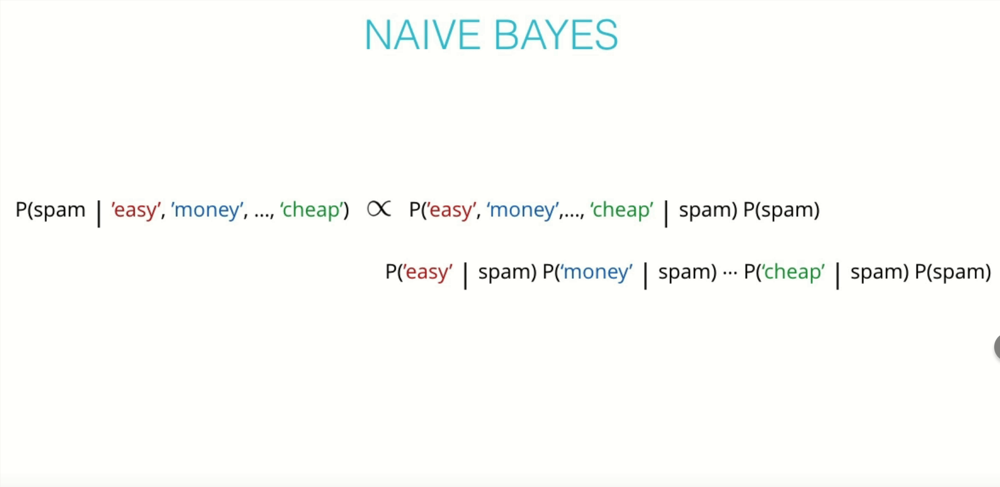

# Spam Classifier with Naive Bayes

## Introduction

Spam detection is one of the major applications of Machine Learning in the interwebs today. Pretty much all of the major email service providers have spam detection systems built in and automatically classify such mail as 'Junk Mail'.

In this mission I will be using **the Naive Bayes algorithm** to create a model that can classify dataset SMS messages as spam or not spam, based on the training I give to the model. It is important to have some level of intuition as to what a spammy text message might look like. 

### What are spammy messages?

Usually they have words like 'free', 'win', 'winner', 'cash', 'prize', or similar words in them, as these texts are designed to catch your eye and tempt you to open them. Also, spam messages tend to have words written in all capitals and also tend to use a lot of exclamation marks. To the recipient, it is usually pretty straightforward to identify a spam text and our objective here is to train a model to do that for us!

Being able to identify spam messages is a binary classification problem as messages are classified as either 'Spam' or 'Not Spam' and nothing else. Also, this is a supervised learning problem, as we know what are trying to predict. I will be feeding a labelled dataset into the Naive Bayes model, that it can learn from, to make future predictions.

In the heart of Naive Bayes algorithm is the probabilistic model that computes the conditional probabilities of the input features and assigns the probability distributions to each of possible classes. Assume:

* We have a bunch of words that we use as  features to tell if the email is spam or not (ham).  Say, easy, money,cheap, etc, 
 
* The first step is to  make the naive assumption to split this into a product of  simple factors that we can quickly calculate by looking at our data.  I do this both for spam and ham.

* We get some values that don't add to one. As a final step, I normalize to get the final probabilities of our email being spam or ham. 

 
**This project has been broken down in to the following steps:**

  * Step 0: Introduction to the Naive Bayes Theorem
  * Step 1.1: Understanding our dataset
   * Step 1.2: Data Preprocessing
  * Step 2.1: Bag of Words (BoW)
   * Step 2.2: Implementing BoW from scratch
   * Step 2.3: Implementing Bag of Words in scikit-learn
  * Step 3.1: Training and testing sets
   * Step 3.2: Applying Bag of Words processing to our dataset.
  * Step 4.1: Bayes Theorem implementation from scratch
   * Step 4.2: Naive Bayes implementation from scratch
  * Step 5: Naive Bayes implementation using scikit-learn
  * Step 6: Evaluating our model
  * Step 7: Conclusion 
    
#### If you'd like to work through the notebooks on your own machine  you can downlad it and then go through [the code](https://github.com/A2Amir/Spam-Classifier-with-Naive-Bayes/blob/main/Bayesian_Inference.ipynb) in my repo.

